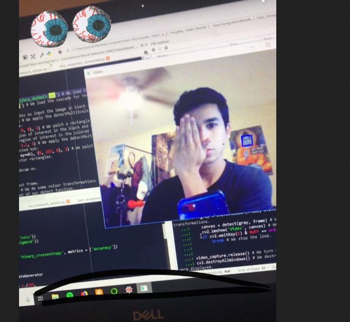
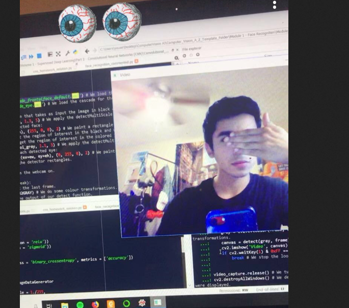
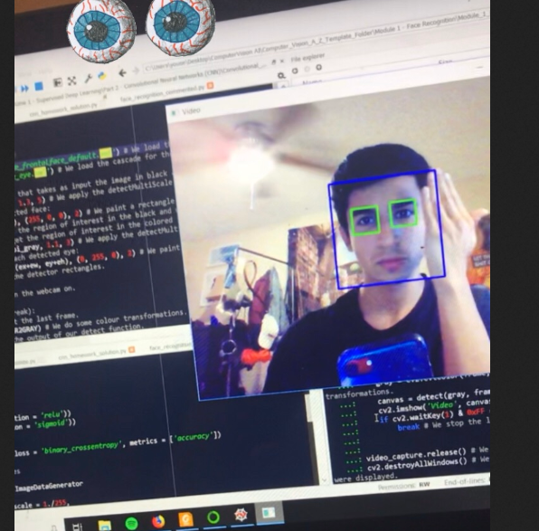
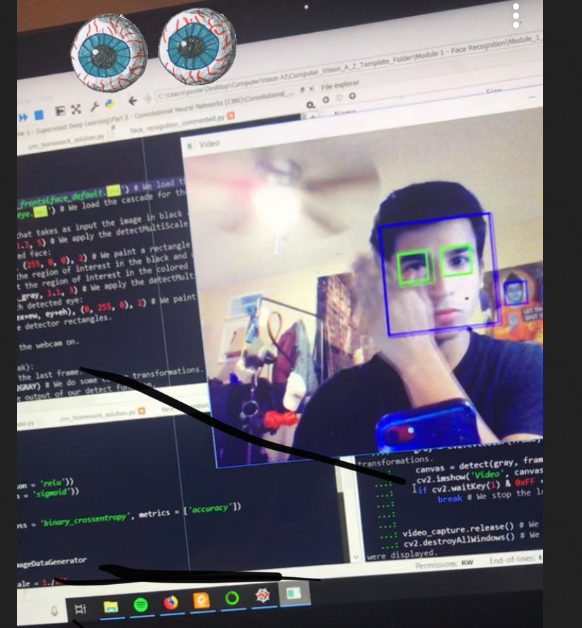

# OpenCVfaceDetection
An OpenCV project I created to detect faces, eyes, and smiles in a webcams image in real-time.
- Made using Python & the CV2 library.
Summary:-
- I used OpenCV's cascade files to help detect the face, eyes, and smiles. Found here :https://github.com/opencv/opencv/tree/master/data/haarcascades
- I initialized cascade classifiers using those cascade files from cv2's GitHub.
- I created a function that used cv2's detectMultiScale() method through the cascade classifiers to locate the faces/eyes/smiles and then used for-loops to imprint rectangles encompassing the area of which the feature was detected onto the return image.
- Used cv2 library to control my webcam, convert the webcams image into grayscale so that the cascades could be implemented. Then use the converted grayscale image as the input to my function which then returned the colored image with the detection rectangles indicating the face, eyes, and smile.
- Configurations of parameters (reduction scaling, minimum neighboring zones required) to achieve appropriate performance.
   

